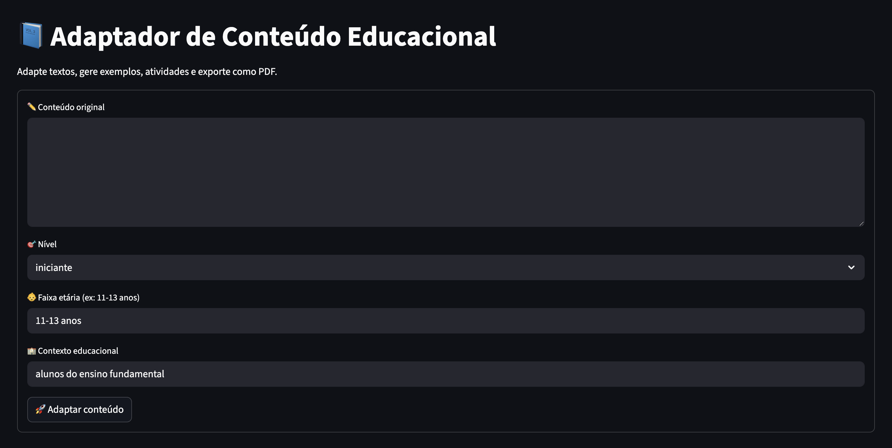

### 📘 Edu Adapt

O Adaptador de Conteúdo Educacional é um sistema inteligente baseado em Generative AI, projetado para adaptar conteúdos educacionais automaticamente. Ideal para professores, pedagogos e criadores de material educacional que desejam acelerar produção de conteúdo de qualidade com IA.

## 🚀 Funcionalidades

- Adaptação automática de textos
Adequação por nível (iniciante/intermediário/avançado), faixa etária e contexto educacional.
- Geração automática de exemplos
Exemplos relevantes, contextualizados e coerentes com o tema.
- Criação de atividades pedagógicas
Atividades prontas para sala de aula, baseadas nos exemplos e conteúdo adaptado.
- Validação e geração de conteúdo final
com estrutura didática.
- Exportação para PDF
- Interface Web
Aplicação para usar o agente.

## 📘 Tela


## 🧪 Requisitos

- Python 3.10+
- Chromium (instalado automaticamente via playwright install)
- Ambiente virtual ativado

## 😎 Como usar?
Faça a configuração do ambiente:

```bash
make setup
```

Configure a variável de ambiente da OpenAI:
```bash
export OPENAI_API_KEY=jsdhkjsdn...
```

Execute a aplicação:
```bash
make ui
```
